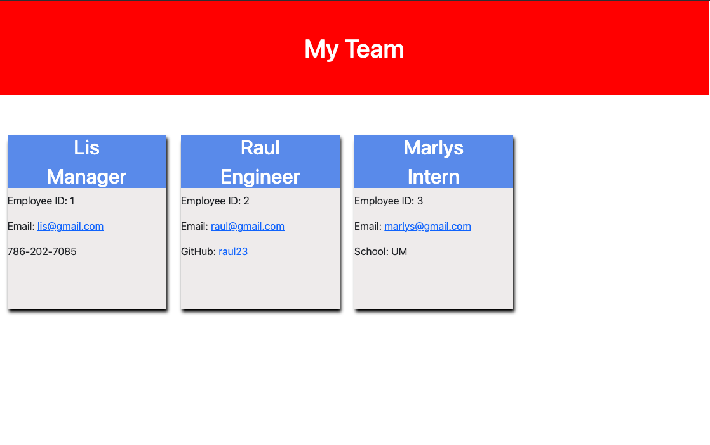

# Team-Profile-Generator

This is a Node.js command-line application that generates a webpage containing a team's basic information based on an user input. 

# Installation
```bash
node index.js
```

# Example of a team profile generated


# Walkthrough Video 
<a href="https://drive.google.com/file/d/1-I-mkPXFShz4Q30GnS_biXNgsrTtRm7H/view">https://drive.google.com/file/d/1-I-mkPXFShz4Q30GnS_biXNgsrTtRm7H/view</a>


