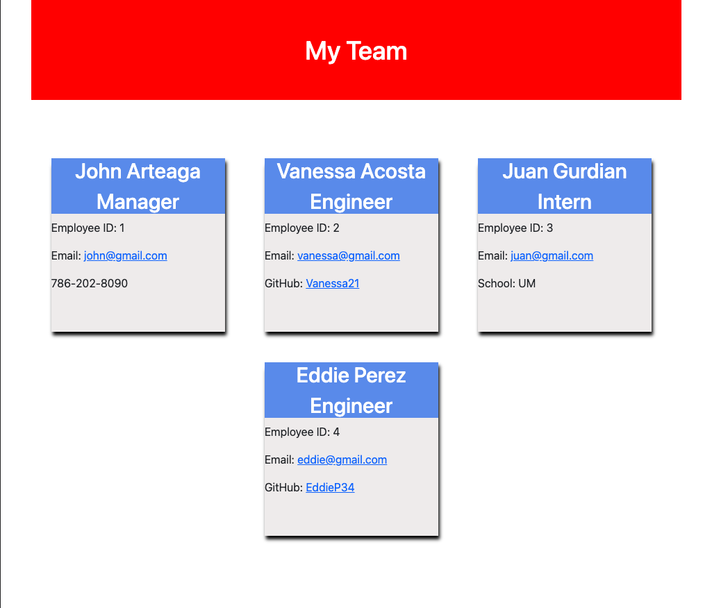

# Team-Profile-Generator

This is a Node.js command-line application that generates an HTML webpage containing a software engineering team basic information based on an user input. 

# Installation
You can clone this repository and run it by typing on your terminal:
```bash
node index.js
```

# User Story
```md
AS A manager
I WANT to generate a webpage that displays my team's basic info
SO THAT I have quick access to their emails and GitHub profiles
```


# Example of a team profile generated


# Walkthrough Video 
<a href="https://drive.google.com/file/d/1-I-mkPXFShz4Q30GnS_biXNgsrTtRm7H/view">https://drive.google.com/file/d/1-I-mkPXFShz4Q30GnS_biXNgsrTtRm7H/view</a>


